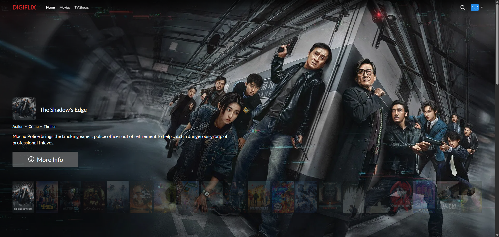
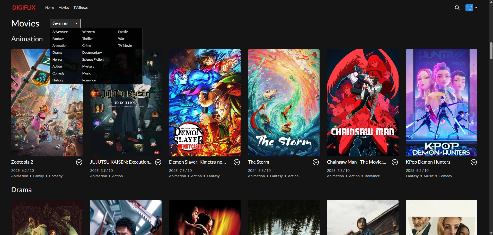
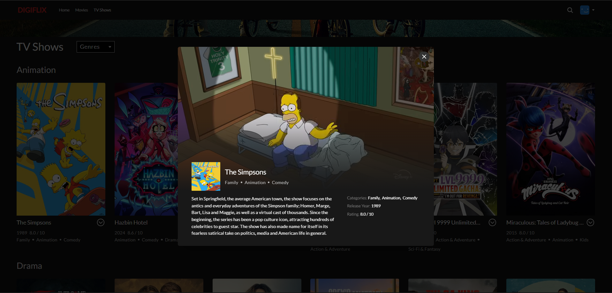
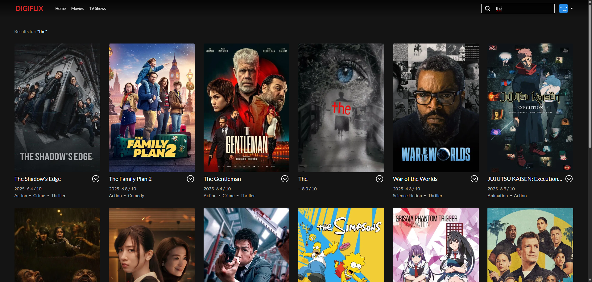

# 🍿 DIGIFLIX - Movie

A modern, responsive streaming service clone built with React and Tailwind CSS. Powered by the TMDB API, it features a sleek interface for browsing movies and TV shows, watching trailers, and managing user profiles.

---

## 🚀 Features

- 📽️ **Browse & Discover**: Explore popular Movies, TV Shows, and specific Genres with infinite scroll support.
- 👤 **Profile Management**: Manage multiple user profiles with a Netflix-style selection screen.
- 🔍 **Smart Search**: Instantly find content by title, genre, or keywords.
- 🎞️ **Immersive Modals**: Click on any card to view detailed info, cast, and watch YouTube trailers within a smooth modal.
- 📱 **Fully Responsive**: Optimized UI that adapts seamlessly from desktops to mobile devices.
- ⚡ **High Performance**: Built with Vite and optimized image loading with skeletons.

---

## 🛠️ Tech Stack

- **React.js** (Vite)
- **Tailwind CSS** (Styling)
- **React Router** (Navigation)
- **Context API** (State Management)
- **Framer Motion** (Animations)
- **Swiper.js** (Carousels)
- **TMDB API** (Data Source)

---

## 🚀 Getting Started

Follow these steps to run the project locally.

### Prerequisites

- Node.js installed on your machine.
- An API Key from [The Movie Database (TMDB)](https://www.themoviedb.org/).

### Installation

1. **Clone the repository**

   ```bash
   git clone https://github.com/talhahappani/digiflix.git
   cd digiflix
   ```

2. **Install dependencies**

   ```bash
   npm install
   ```

3. **Configure API Key**
   Create a `.env` file in the root directory and add your TMDB API key:

   ```env
   VITE_API_KEY=your_tmdb_api_key_here
   ```

4. **Run the project**

   ```bash
   npm run dev
   ```

   The app will be available at http://localhost:5173

---

## 🔧 File Structure

```
digiflix/
├── public/
├── src/
│   ├── components/     # Reusable UI components (Header, Card, Modal, etc.)
│   ├── context/        # Context API (MovieModal, ProfileContext)
│   ├── data/           # Static data (Genres list)
│   ├── hooks/          # Custom hooks (useMovies, useScroll, useDocumentTitle)
│   ├── pages/          # Application pages (Home, Movies, Search, etc.)
│   ├── App.jsx
│   └── main.jsx
├── .env                # Environment variables
├── .gitignore
├── package.json
├── tailwind.config.js
└── README.md
```

---

## 📸 Screenshots

<div align="center">
  
  <br/><br/>
  
  <br/><br/>
  
  <br/><br/>
  
  <br/><br/>
  
</div>

## 📝 License

[MIT](LICENSE)
